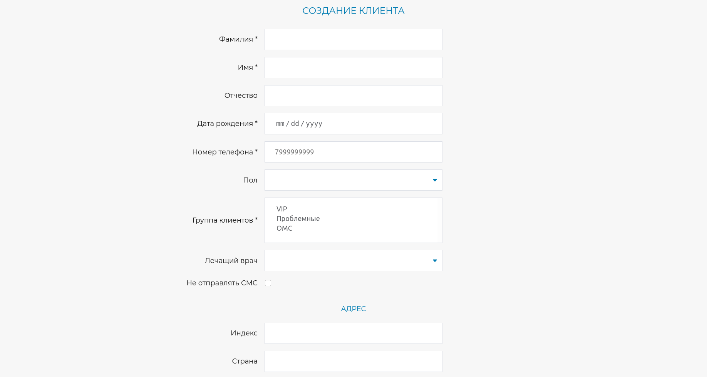

# Форма создания клиента

Тестовое задание на позицию Junior Frontend Developer

## Используемые технологии

- Vue.js 
- Vuelidate
- Sass

## Установка и запуск

```
npm install
```

Запуск в development mode

```
npm run serve
```

Запуск в production mode

```
npm run build
```

## Демо

https://deodaro.github.io/customer-form-vue/

## Скриншот

